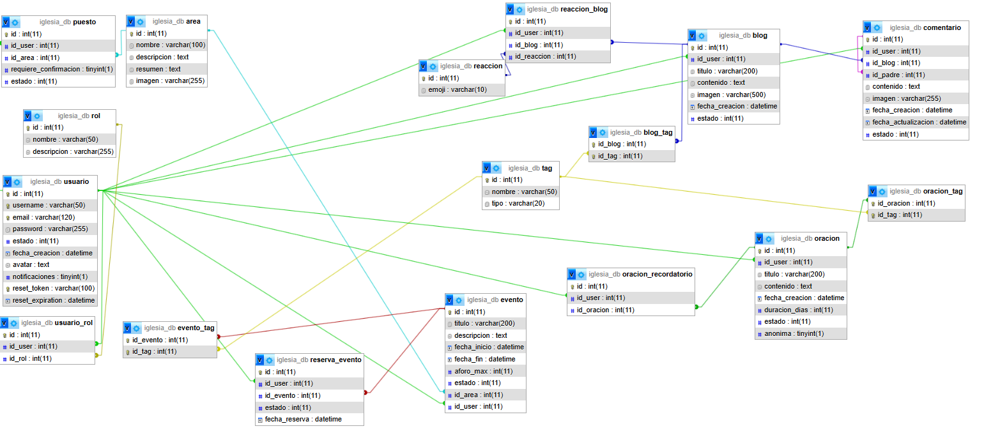
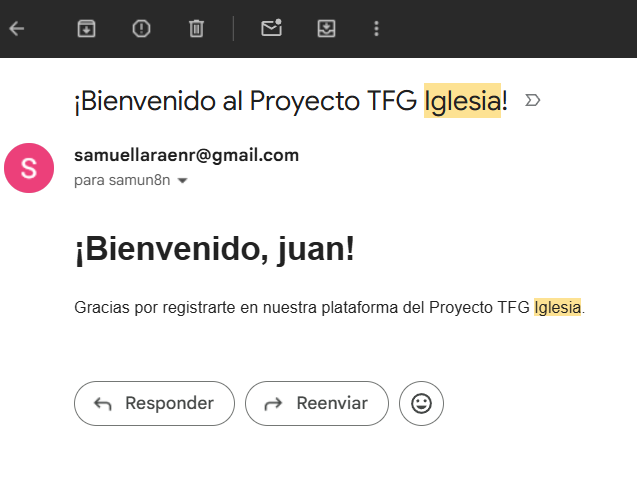
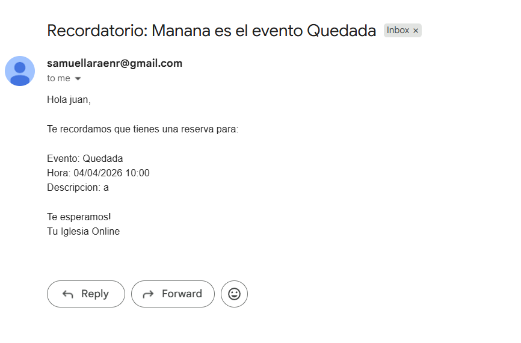
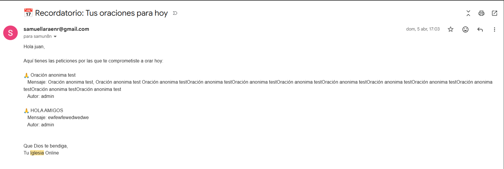
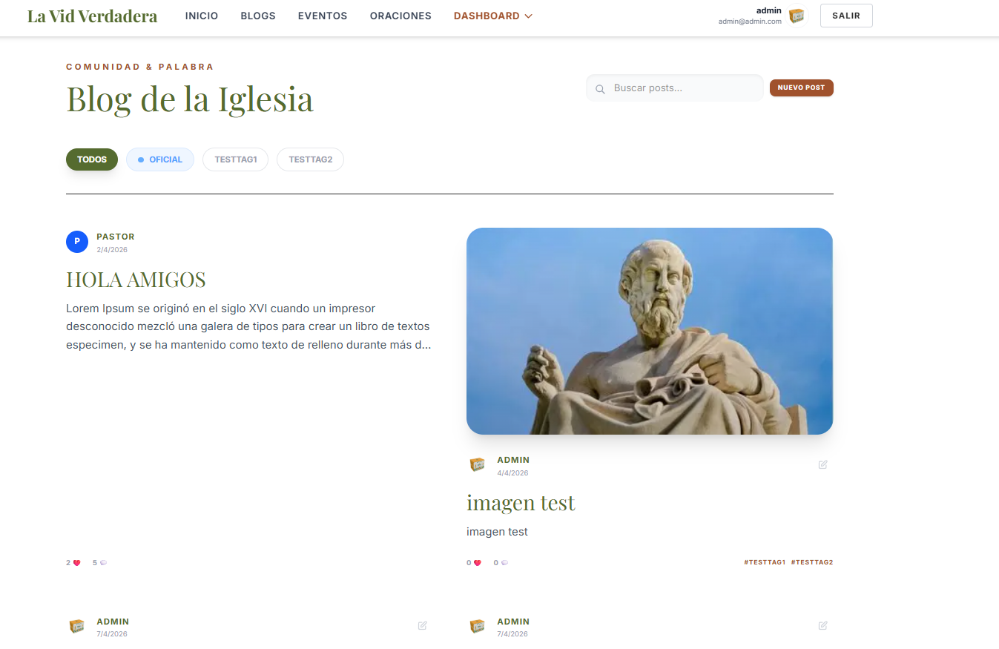
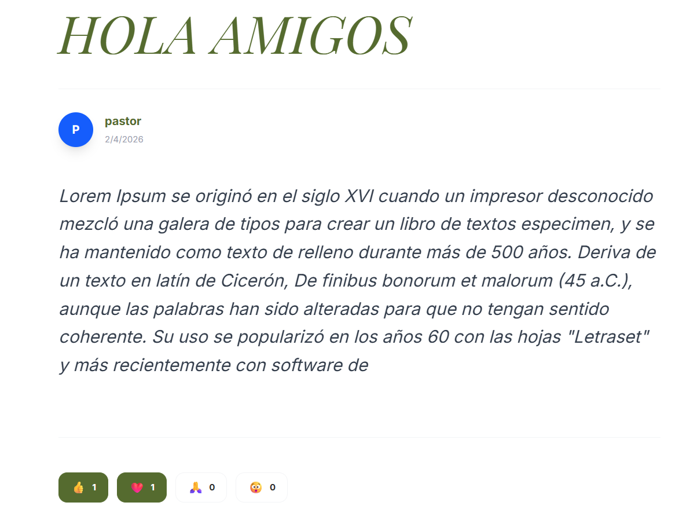
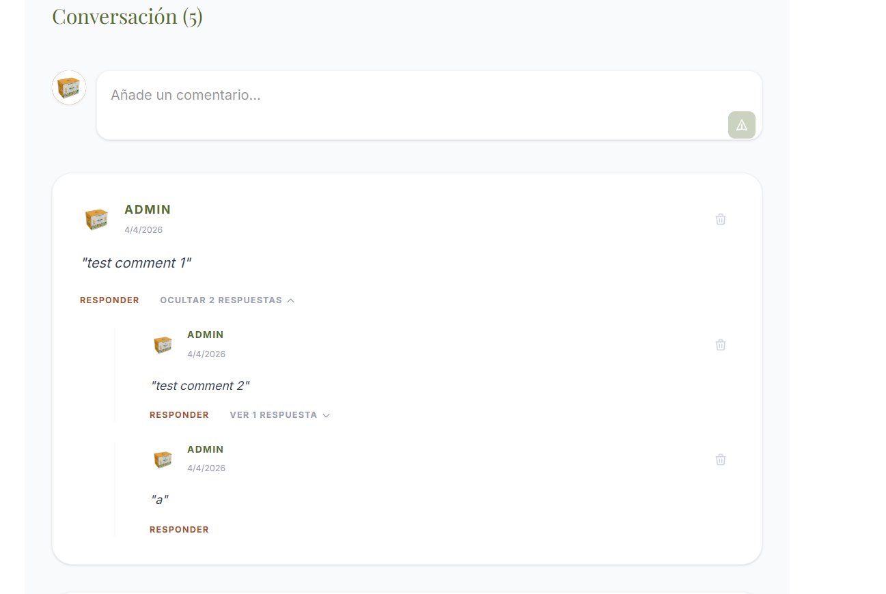
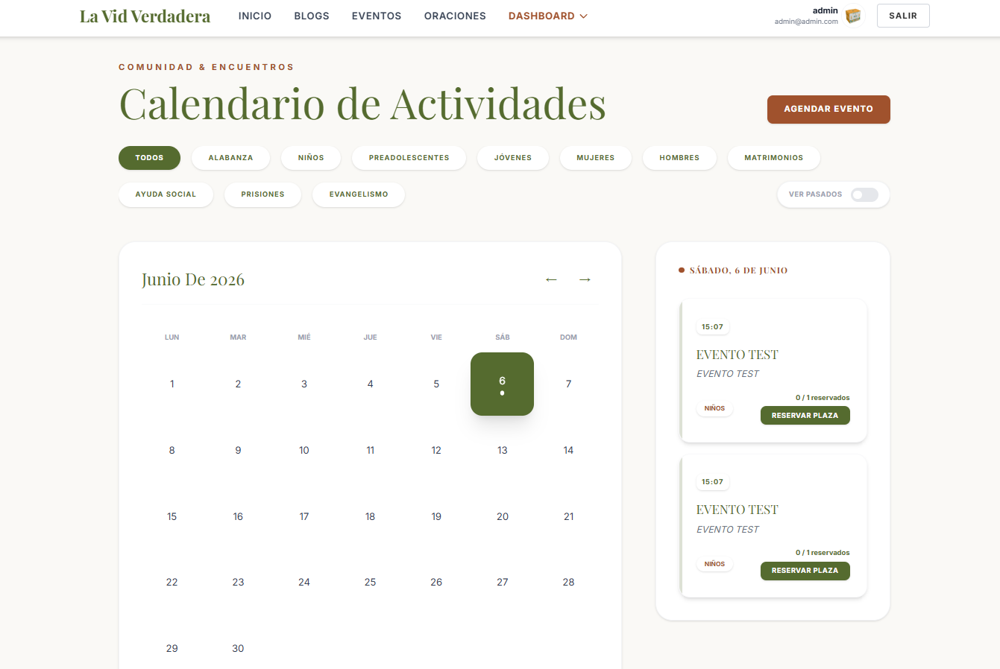
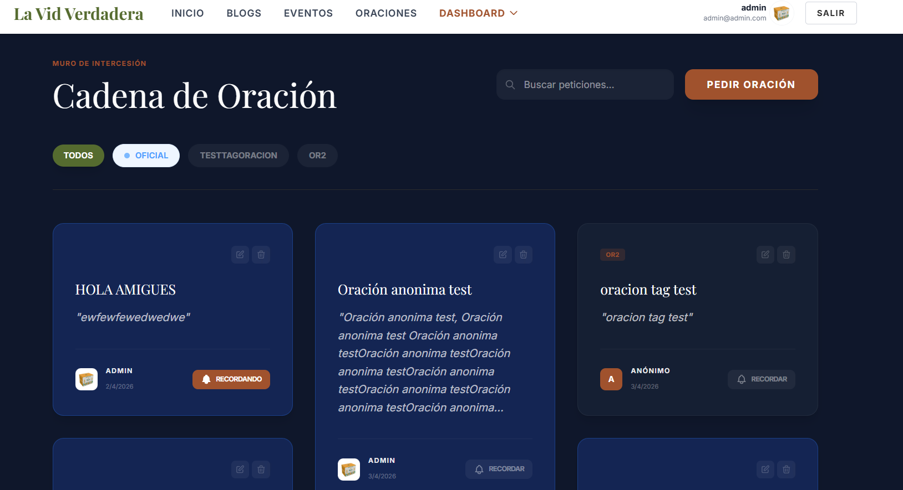
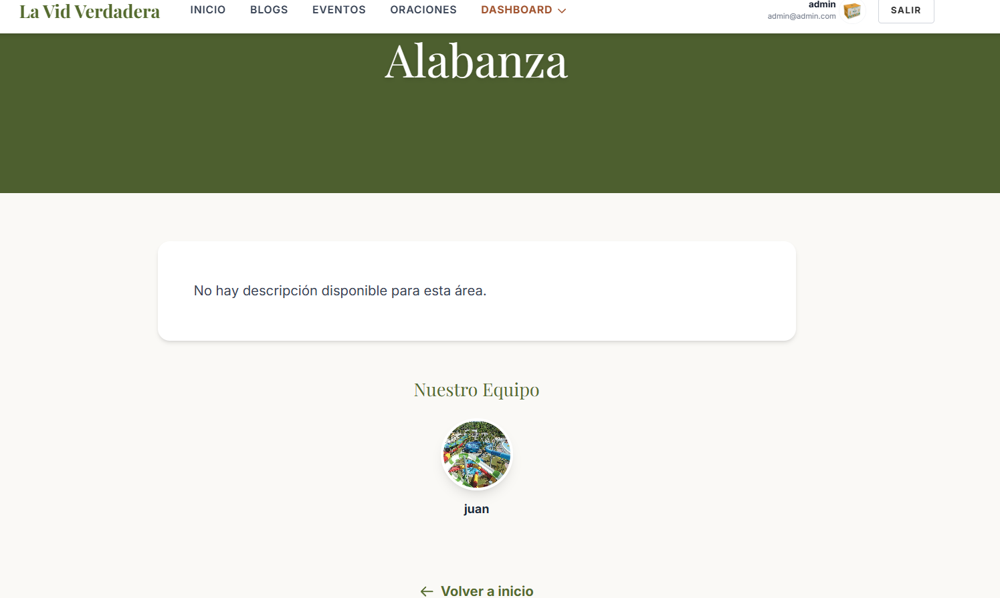

# Documentación del Proyecto: Renovación Web - La Vid Verdadera

Este documento detalla la arquitectura, funcionalidades y aspectos técnicos del proyecto final de grado.

## 1. Resumen y Propósito
Este proyecto nace con el objetivo principal de renovar y modernizar la presencia digital de la comunidad cristiana **La Vid Verdadera** ([https://iglesialavidverdadera.com/](https://iglesialavidverdadera.com/)). La plataforma resultante es una solución integral diseñada para la gestión comunitaria, centralizando la comunicación y la organización de actividades de la iglesia. Permite a los usuarios interactuar a través de blogs, participar en cadenas de oración y gestionar la asistencia a eventos y ministerios (áreas) con una interfaz moderna y eficiente.

**Funcionalidades clave:**
- Gestión de ministerios (Áreas) con responsables específicos.
- Calendario interactivo de eventos con reserva de plazas.
- Sistema de blogs con reacciones y comentarios.
- Muro de oraciones con recordatorios personalizados.
- Panel de administración para gestión de usuarios y contenidos.
- Sistema de roles y permisos para gestionar el acceso a diferentes funcionalidades.
- Sistema de notificaciones para mantener a los usuarios informados sobre eventos y actividades.
- Sistema de restablecimiento de contraseña mediante tokens seguros enviados por correo electrónico.
- Dashboard integral para la edición, moderación y gestión de la plataforma.
- Interfaz optimizada para su visualización en dispositivos móviles, tablets y ordenadores de escritorio.
---

## 2. Tecnologías Utilizadas

### Frontend
- **React 19**: Biblioteca fundamental para el desarrollo de la interfaz de usuario basada en componentes.
- **Vite**: Herramienta de compilación y servidor de desarrollo ultrarrápido.
- **TypeScript**: Superset de JavaScript para un desarrollo tipado y libre de errores en tiempo de ejecución.
- **Tailwind CSS v4**: Framework de diseño para una estética premium basada en utilidades modernas.
- **React Router Dom v7**: Gestión avanzada del enrutamiento y la navegación SPA (Single Page Application).
- **Axios**: Cliente HTTP para la comunicación asíncrona con la API del backend.
- **Lucide React**: Biblioteca de iconografía vectorial y minimalista.
- **Sonner**: Sistema de notificaciones (toasts) dinámicas con Feedback inmediato al usuario.
- **React Context API**: Gestión de estados globales para la autenticación y el dashboard.

### Backend
- **Python 3.11**: Lenguaje de programación principal.
- **Flask**: Micro-framework para la creación de la arquitectura de la API REST.
- **Flask-SQLAlchemy**: ORM para la gestión de modelos y comunicación con la base de datos de forma relacional.
- **Flask-Migrate**: Basado en Alembic, gestiona de forma automática las versiones y cambios en el esquema de la base de datos.
- **Flask-Login**: Sistema robusto para el manejo de sesiones de usuario y persistencia de autenticación.
- **Flask-APScheduler**: Motor para la ejecución de tareas programadas en segundo plano (limpieza de datos temporales, envío de correos cíclicos).
- **Flask-Mailman**: Suite para la integración con servidores SMTP (Gmail) para el envío de notificaciones y recuperación de cuentas.
- **Flask-CORS**: Middleware para gestionar las políticas de seguridad entre el frontend y el backend.
- **Werkzeug Security**: Aplicación de algoritmos de hashing seguros para el almacenamiento de contraseñas.
- **PyMySQL**: Controlador de bajo nivel para la conexión eficiente con MariaDB/MySQL.
- **Python-Dotenv**: Gestión segura de secretos y variables de entorno mediante archivos `.env`.
- **UUID & Werkzeug Utils**: Utilizados para la gestión segura de nombres de archivos y almacenamiento de imágenes.

### Base de Datos
- **MariaDB / MySQL**: Motor de base de datos relacional.
- **phpMyAdmin**: Interfaz gráfica para la gestión de la base de datos en desarrollo.

---

## 3. Modelo Entidad-Relación y Tablas

El diseño de la base de datos es relacional y se estructura en torno al usuario y su participación en las distintas áreas de la comunidad de La Vid Verdadera.

### Tablas Principales:
1.  **usuario**: Almacena credenciales, estado, avatar y preferencias de notificación.
2.  **rol**: Define los niveles de acceso (Administrador, Pastor, Supervisor, etc.).
3.  **usuario_rol**: Tabla asociativa N:M entre usuarios y roles.
4.  **area**: Representa los ministerios o departamentos de la iglesia.
5.  **puesto**: Relación entre un usuario y un área, definiendo su cargo o pertenencia.
6.  **blog**: Entradas de contenido creadas por los usuarios.
7.  **comentario**: Comentarios de los usuarios en las entradas de blog.
8.  **reaccion**: Catálogo de tipos de reacciones (Likes, Corazones, etc.).
9.  **reaccion_blog**: Registro de qué usuario dejó qué reacción en qué blog.
10. **evento**: Actividades programadas, vinculadas a un área específica.
11. **reserva_evento**: Registro de plazas reservadas por los usuarios para eventos.
12. **oracion**: Peticiones de oración compartidas por la comunidad.
13. **oracion_recordatorio**: Sistema de seguimiento para que los usuarios oren por peticiones específicas.
14. **tag**: Etiquetas globales para categorizar blogs, eventos y oraciones.
15. **relaciones_tags**: Tablas asociativas que vinculan tags con blogs, eventos u oraciones (N:M).

> [!NOTE]
> El esquema detallado se puede visualizar en el archivo `documentacionImagenes/Esquema-ER.png`.



---

## 4. Roles de Usuario

La plataforma implementa un sistema de control de acceso basado en roles:

1.  **Administrador**: Control total sobre usuarios, roles y configuración global.
2.  **Pastor**: Visión general de todas las áreas, capacidad de admitir eventos y moderar contenido.
3.  **Supervisor (Pontífice)**: Responsable de una o varias áreas. Puede crear y editar eventos de sus respectivos ministerios.
4.  **Ayudante**: Usuario con permisos extendidos en ciertas áreas para ayudar en la gestión.
5.  **Usuario**: Puede leer blogs, reaccionar, pedir oraciones y reservar plazas en eventos.
6.  **Visitante**: Acceso limitado a lectura de blogs y eventos públicos. Requiere registro para interactuar.

---

## 5. Casos de Uso (Perspectiva de Rol)

### Desde el punto de vista del Usuario Estándar:
- **Participar en la comunidad**: Leer las últimas noticias en el Blog y dejar una reacción.
- **Espiritualidad compartida**: Publicar una petición de oración y recibir recordatorios de oraciones con las que interactuó.
- **Organización personal**: Reservar plaza para el próximo evento de jóvenes.
- **Perfil**: Gestionar su avatar y ver su historial de actividad (mis reservas, mis blogs, recordatorios...). 

### Desde el punto de vista del Visitante:
- **Observar la comunidad**: Leer las últimas noticias en el Blog y ver los eventos próximos.
- **Registrarse**: Registrarse en la plataforma para poder interactuar con la comunidad.

### Desde el punto de vista del Supervisor de Área:
- **Gestión de actividades**: Crear un nuevo evento para su ministerio (ej. "Retiro de Jóvenes") definiendo el aforo.
- **Admitir actividades**: Si un evento requiere aprobación, el supervisor o pastor puede validarlo desde el panel.
- **Control de miembros**: Ver qué usuarios pertenecen a su ministerio.

### Desde el punto de vista del Ayudante:
- **Gestión de actividades**: Crear un nuevo evento para su ministerio (ej. "Retiro de Jóvenes") definiendo el aforo.
- **Admitir actividades**: Si un evento requiere aprobación, el supervisor o pastor puede validarlo desde el panel.
- **Control de miembros**: Ver qué usuarios pertenecen a su ministerio.

### Desde el punto de vista del Administrador/Pastor:
- **Moderación**: Eliminar contenido inapropiado o gestionar estados de usuarios.
- **Asignación de Roles**: Promocionar a un Usuario a Supervisor de un área específica.
- **Aprobación global**: Supervisar que todas las áreas funcionan correctamente.


---

## 6. Despliegue y Dockerización

El proyecto está completamente "dockerizado", lo que garantiza que funcione de la misma manera en cualquier entorno.

### Configuración de Docker
Se utiliza **Docker Compose** para orquestar los siguientes servicios:

-   **Servicio de Base de Datos (db)**: Utiliza la imagen oficial de `mariadb:latest`. Los datos son persistentes gracias a un volumen de Docker (`mariadb_data`).
-   **Servicio de Administración de BD (phpmyadmin)**: Accesible en el puerto `8080`, facilita la inspección de datos.
-   **Servicio Backend (backend)**:
    -   Construido a partir de una imagen de `python:3.11-slim`.
    -   Instala dependencias necesarias (`mysqlclient`, `flask`, etc.).
    -   Se comunica con la base de datos mediante variables de entorno definidas en un archivo `.env`.
    -   Expone el puerto `5000`.

### Pasos para el Despliegue Local:
1.  Clonar el repositorio.
2.  Configurar el archivo `.env` con las credenciales de BD.
3.  Ejecutar el comando:
    ```bash
    docker-compose up --build
    ```
4.  El backend estará disponible en `localhost:5000` y el frontend (si se sirve por separado o se integra) en su puerto correspondiente.

---

## 7. Seguridad y Gestión de Errores

### Mecanismos de Seguridad:
- **Autenticación de Sesión**: Implementada mediante `Flask-Login` con cookies seguras y protección contra ataques de fijación de sesión.
- **Hashing de Contraseñas**: Uso del algoritmo PBKDF2 (vía Werkzeug) para asegurar que las contraseñas no se almacenen en texto plano.
- **Protección CORS**: Configuración estricta de orígenes permitidos para evitar peticiones no autorizadas desde otros dominios.
- **Validación de Datos**: Doble capa de validación tanto en el frontend (TypeScript/Zod/HTML5) como en el backend (SQLAlchemy/Flask) para prevenir inyecciones SQL y Datos corruptos.
- **Tokens de Recuperación**: Uso de tokens seguros de un solo uso con expiración temporal (1 hora) para el restablecimiento de contraseñas.
- **Control de Acceso (RBAC)**: Middleware en el backend que verifica permisos específicos para cada acción (Crear, Editar, Eliminar) según el rol y la propiedad del recurso.

### Gestión de Errores:
- **Controladores de Error 500/404**: Personalizados para devolver respuestas JSON estandarizadas al frontend.
- **Feedback Continuo**: Integración de `Sonner` en el frontend para informar al usuario sobre el éxito o fracaso de cada operación mediante notificaciones visuales no intrusivas.


## 8. Sistema de Notificaciones por Correo

La plataforma utiliza un sistema automatizado de correos electrónicos para mantener informada a la comunidad, gestionado a través de `Flask-Mailman` y tareas programadas con `Flask-APScheduler`.

### Correo de Bienvenida
Notificación enviada automáticamente tras el registro exitoso de un nuevo miembro.


### Recordatorio de Eventos
Aviso enviado a los usuarios con reservas activas para recordarles las próximas actividades.


### Recordatorio de Oraciones
Sistema de seguimiento para las peticiones de oración, enviando recordatorios a los usuarios que se comprometieron a orar por otros.


---

## 9. Interfaz de Usuario y Capturas

A continuación se presenta una galería detallada de las principales secciones de la aplicación, destacando el diseño premium y la experiencia de usuario optimizada.

### 9.1 Exploración de Contenido: Blog
El sistema de blogs permite a la comunidad compartir reflexiones y noticias con un diseño moderno basado en tarjetas dinámicas.

- **Muro de Blogs**: Vista general con filtrado por categorías y búsqueda.
  

- **Detalle de Blog**: Lectura inmersiva con soporte para comentarios y reacciones en tiempo real.
  
  

### 9.2 Comunidad y Actividades
Gestión interactiva de eventos y muro de oraciones, facilitando la participación activa de los miembros.

- **Calendario de Eventos**: Interfaz intuitiva para la visualización de actividades programadas y reserva de plazas.
  

- **Muro de Oraciones**: Espacio dedicado a las peticiones de la comunidad con sistema de compromiso de oración.
  

### 9.3 Gestión de Áreas y Ministerios
Cada ministerio cuenta con su propio espacio donde se detallan sus objetivos, responsables y actividades específicas.

- **Detalle de Área**: Información completa sobre un ministerio, incluyendo galería de miembros y eventos vinculados.
  

---

## 10. Conclusión
Este proyecto representa la renovación tecnológica de la presencia online de **La Vid Verdadera**, ofreciendo una solución moderna y escalable para la gestión de su comunidad. Integra las mejores prácticas de desarrollo web tanto en frontend como en backend para asegurar una experiencia premium a todos sus miembros.

---
